<h3>Description</h3>
une application basée sur une architecture micro-service qui permet de gérer les factures contenant des produits et appartenant à un client.
<h3>Les étapes</h3>
le micro-service customer-service qui permet de gérer les client
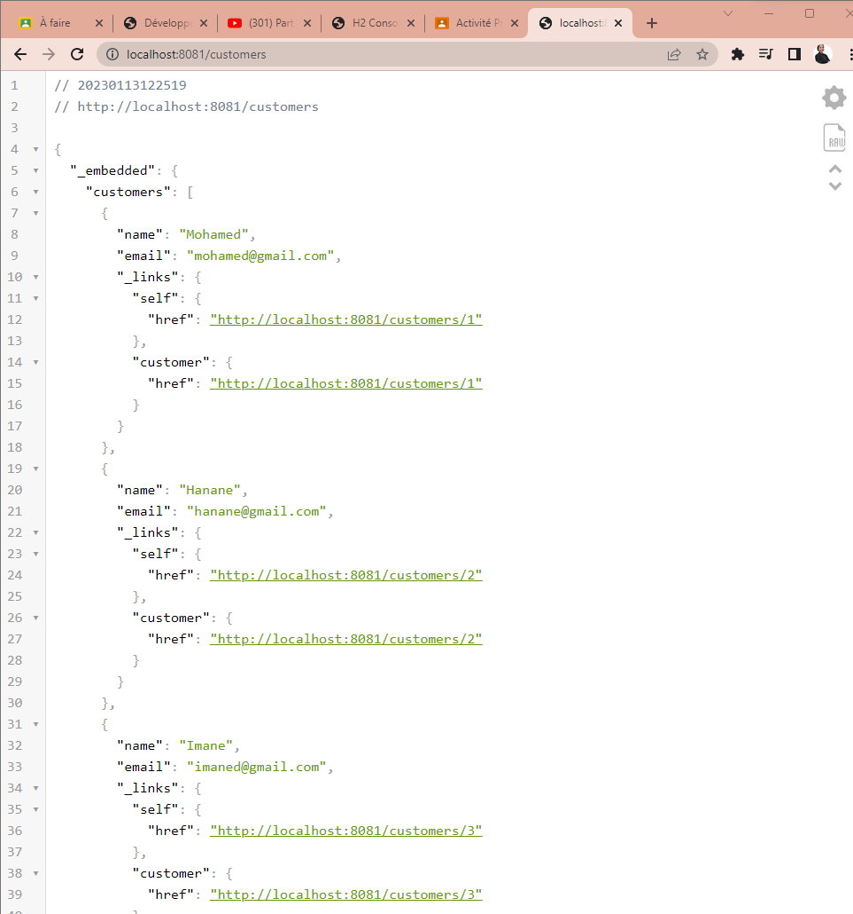
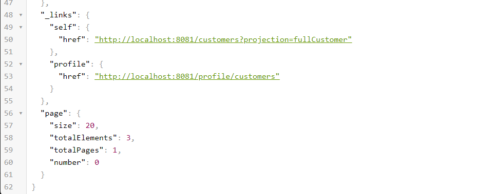

le micro-service inventory-service qui permet de gérer les produits
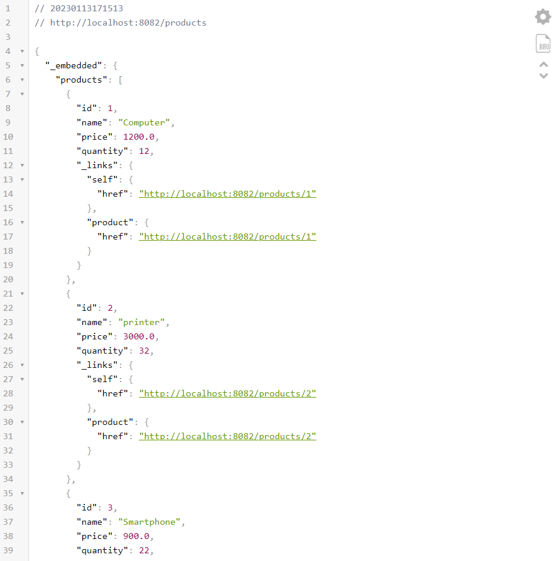
la Gateway Spring cloud Gateway
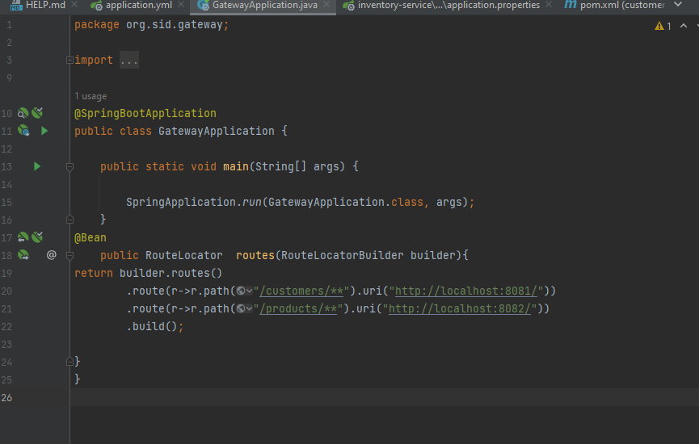
statique du système de routage
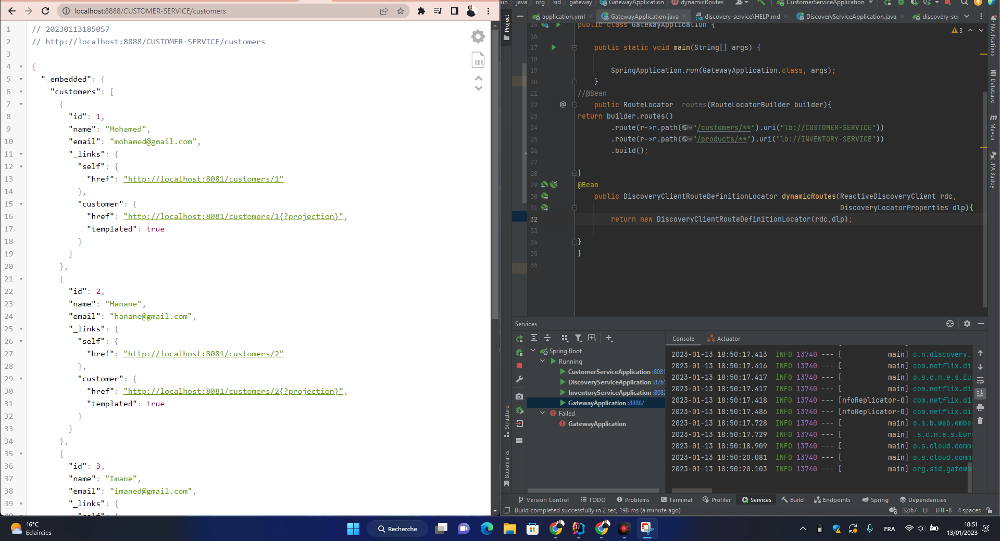
l'annuaire Eureka Discrovery Service
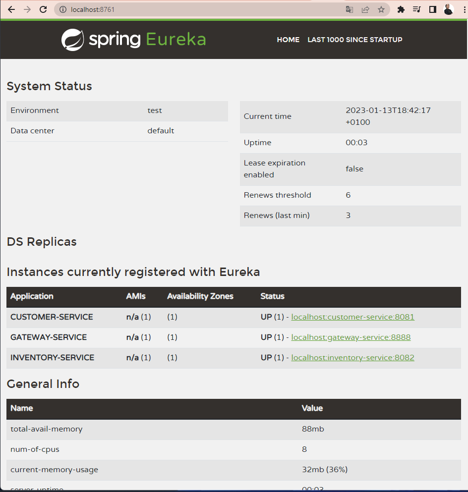
une configuration dynamique des routes de la gateway

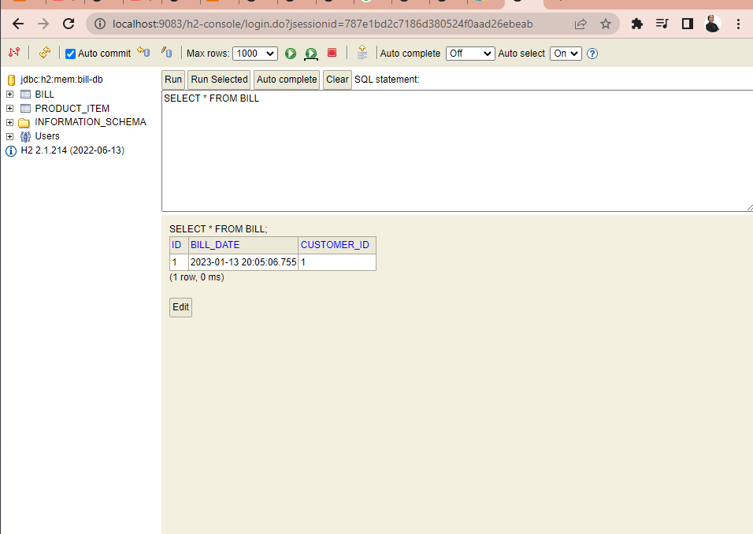
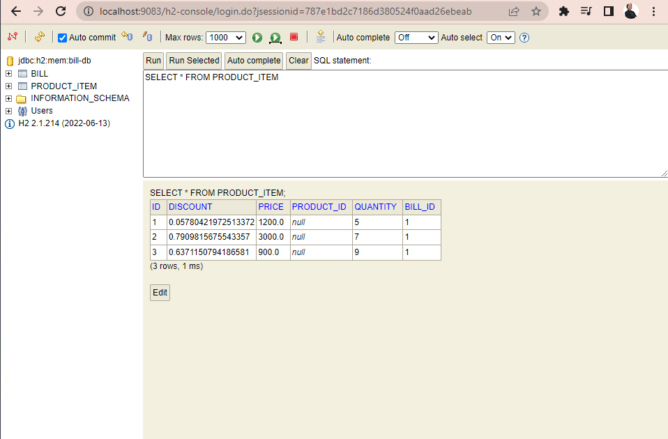
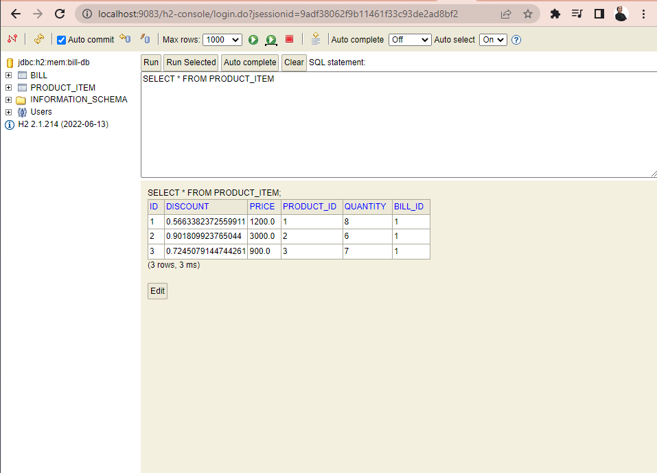
Service de farcturation Builling-Service en utilisant OpenFeign
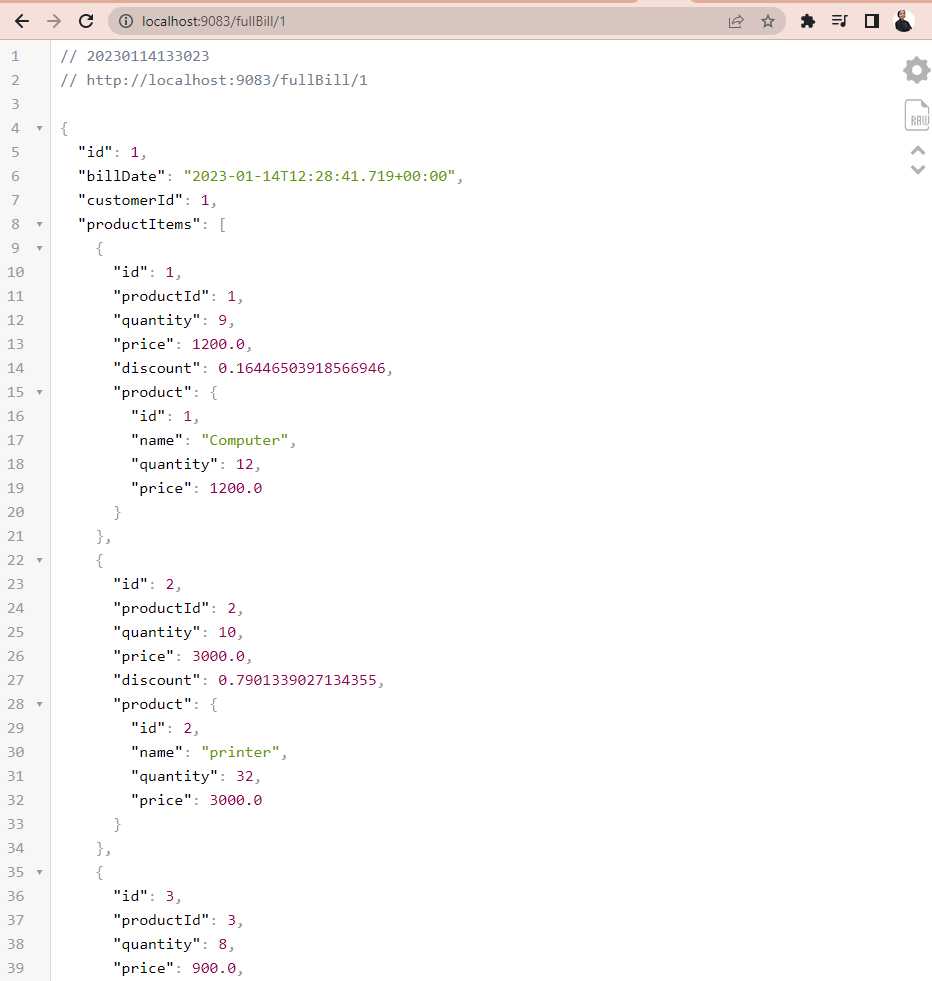
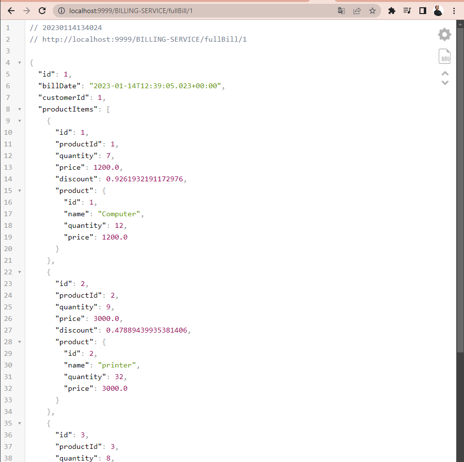
un client Web Angular (Clients, Produits, Factures)
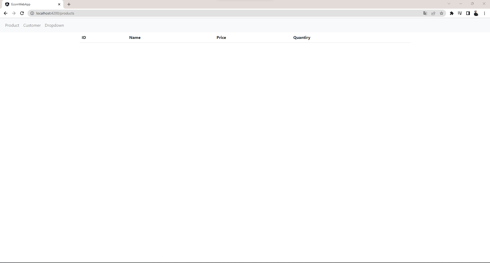

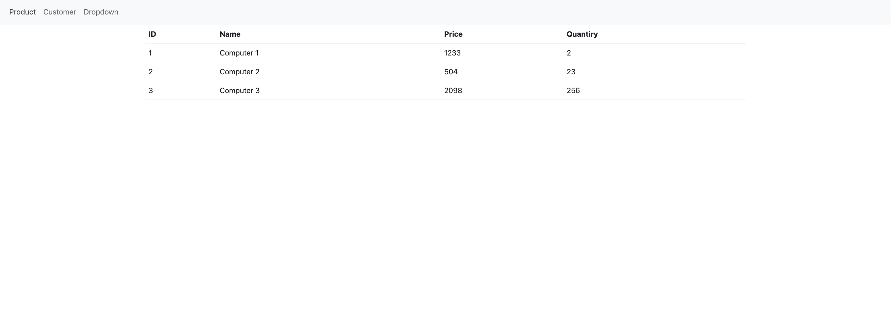
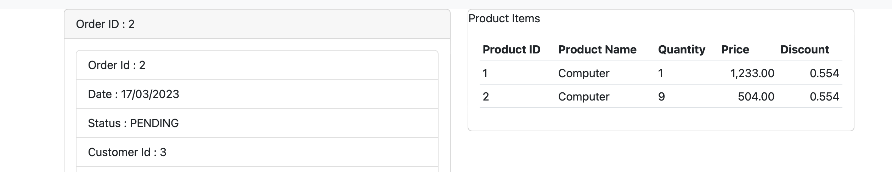
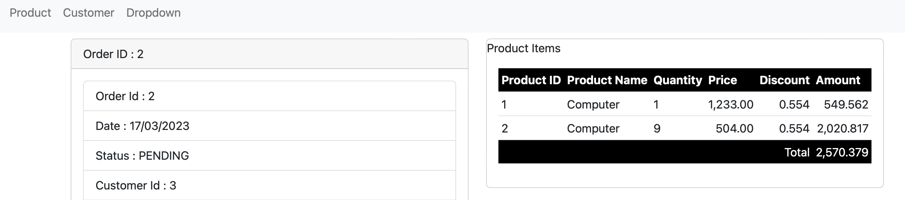
le serveur keycloak
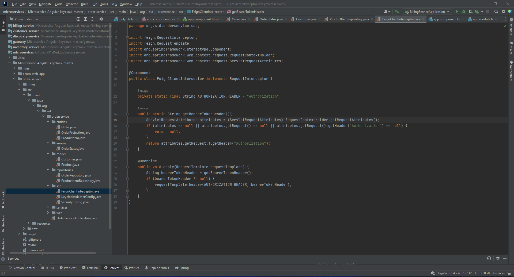
